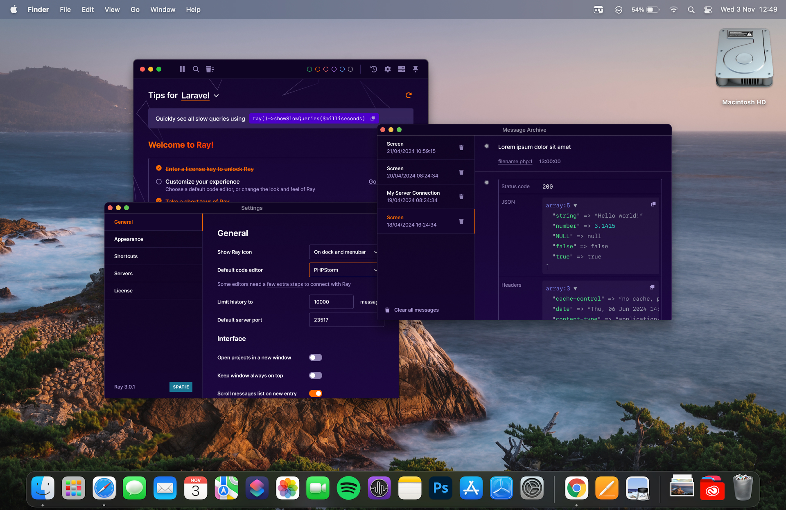

# [Ray v3 Open Beta](https://next.myray.app/)

> "Understand and fix bugs faster"
>
> Ray is a desktop application that serves as the dedicated home for debugging output. Send, format and filter debug information from both local projects and remote servers.

More information about the open beta can be found here: [next.myray.app](https://next.myray.app/).

## Purpose of this repository

We’ll be using this repository to collect feedback and track issues throughout the open beta period of the new Ray application.

When creating an issue, please follow the provided issue template.

If you have a feature request, an idea, or anything else you’d like to discuss, feel free to open a new discussion. Be sure to clearly describe your idea or request. While we appreciate all suggestions, we won’t automatically implement everything — Spatie will always have the final say on whether a feature or idea moves forward.

We’ll do our best to respond promptly to all issues and discussions. However, please keep in mind that we’re also actively developing Ray, which will remain our main focus in the coming weeks, so there may be slight delays in response times.

As a rule, issues and bugs will always take priority over feature requests.

---

